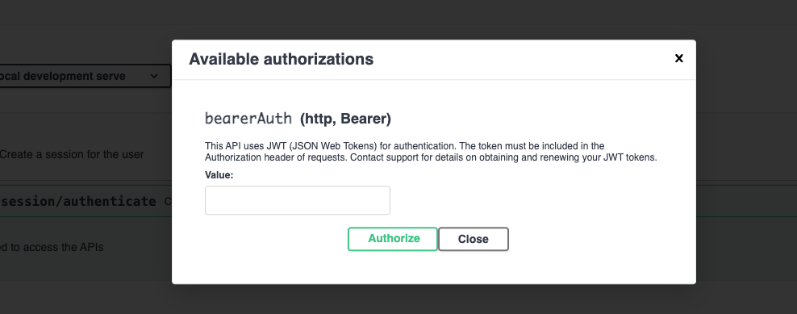
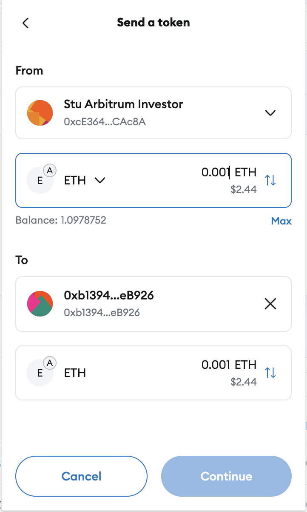

# Arbitrum

## Initial Setup

### Install yarn
**Option 1:**
yarn installation via Node
```shell
brew install node
npm install --global yarn
```

**Option 2:**
yarn installation via Homebrew for mac:
```shell
brew install yarn
```

### Install docker
For more convenient experience, please download the docker desktop
https://www.docker.com/products/docker-desktop

### Install maven
```shell
brew install maven
```

### Create User wallet
Follow these instructions to create your `User` wallet (MetaMask) and add the extension to your browser:
- https://support.metamask.io/getting-started/getting-started-with-metamask/

### Create Master Worker wallet
Follow these instructions to create your `Master Worker` wallet (MetaMask) and add the extension to your browser:
- https://support.metamask.io/getting-started/getting-started-with-metamask/

This wallet should have a liquidity of at least 2 ETH.  
Once the wallet is created, for running locally create a file `services/.env.services.secrets` and add the following environment variables with their relevant values:
```dotenv
VAULT_WORKER_ADDRESS="<MASTER WORKER WALLET ADDRESS>"
VAULT_WORKER_PRIVATE_KEY="<MASTER WORKER WALLET PRIVATE KEY>"
```

### Blockchain Network Provider
Set up a blockchain network provider (for Arbitrum Sepolia) e.g. https://www.infura.io/.  
Then add to the same file mentioned above (`services/.env.services.secrets`) the following environment variables with their relevant values:
```dotenv
BLOCKCHAIN_NETWORK="<wallet provider URL (for Arbitrum Sepolia) e.g. infura>"
BLOCKCHAIN_WSS_NETWORK="wallet provider Web Socket endpoint (for Arbitrum Sepolia) e.g. infura"
```

## Build
```shell
make -C infra build_all
``` 

## Deploy
To arbitrum sepolia testnet: https://sepolia.arbiscan.io/
```shell
make -C infra testnet-local-deploy
``` 
after it has finished, please check http://localhost:8080/openapi/

## Un-Deploy
```shell
make -C infra clean-local-deployment
``` 

## Demo
### Roles
- **admin**: manage the app
- **investor**: a user of Investerra webapp

### Overview
In this demo, we will walk through a scenario, using swagger (openapi), covering the following steps: 

1) Authenticate as an admin.
2) Register a new user (investor).
3) Create a new opportunity.
4) Add the registered user (investor) to the opportunity's whitelist (In the real thing this would be after passing KYC).
5) Transfer Ether to the opportunity.
6) Pay interest, as admin, to the investor from the opportunity.

#### 1. Authenticate as an Admin
- Go to `api/v1/session/authenticate` (http://localhost:8080/openapi/#/User-session/createUserSession)
- Click `Try it out`, and then `Execute`
```json
{
  "token": "eyJhbGciOiJIUzI1NiIsInR5cCI6IkpXVCJ9...",
  "refreshToken": "eyJhbGciOiJIUzI1NiIsInR5cCI6IkpXVCJ9...",
  "userId": "471ac52f-90dc-4838-ada8-cd774c952442"
}
```

- Copy the `token` value (omitting the double quotes) and paste it into the authorize window
- click on `Authorize` and then `Close`.


#### 2. Register a User (investor)
- Go to `api/v1/admin/investors/register/new` (http://localhost:8080/openapi/#/Investors-managment/registerNewInvestor)
- Click `Try it out`
- Update the payload body
- Click `Execute`
```json
{
  "name": "investor1",
  "emailAddress": "investor1@noumenadigital.com",
  "company": "noumena",
  "password": "password1",
  "walletAddress": "0xcW581ac20E797d6887eD13f654BDeFF7d29CEf8C"
}
```
- Check that the state is active by navigating here and checking the response http://localhost:8080/openapi/#/Investors-managment/getInvestorlist
```json
{
  "requests": [
    {
      "name": "investor1",
      "emailAddress": "investor1@noumenadigital.com",
      "company": "noumena",
      "walletAddress": "0xcW581ac20E797d6887eD13f654BDeFF7d29CEf8C",
      "status": "active"
    }
  ]
}
```

#### 3. Create an Opportunity
- Go to `api/v1/admin/opportunities/new` (http://localhost:8080/openapi/#/Opportunity-managment/createnewOpportunity)
- Click `Try it out`
- Update the payload body
- Setting the query param `overrideDeadline` to `true` makes subscription period end in 2 minutes for demo purposes  
- Click `Execute`
```json
{
  "name": "Test Opportunity 1",
  "interestRepayment": "monthly",
  "interestRate": 10,
  "nominalAmount": 0.1,
  "minimalTokenTranche": 0.00005,
  "subscriptionPeriodEnd": "2024-10-10",
  "maturityDate": "2025-04-08"
}
```
- Go to `api/v1/opportunities` (http://localhost:8080/openapi/#/Opportunity-managment/getOpportunitylist)
- Click `Try it out`, and then `Execute`
- Verify the state is `subscriptionPeriod`
```json
{
  "requests": [
    {
      "id": "ddb6ef03-feae-45e7-8d18-3f341d46a9a2",
      "name": "Test Opportunity 1",
      "interestRepayment": "MONTHLY",
      "interestRate": 10,
      "nominalAmount": 0.1,
      "minimalTokenTranche": 0.00005,
      "numberOfPayments": 3,
      "subscriptionPeriodEnd": "2024-10-10",
      "maturityDate": "2025-01-10",
      "contractAddress": "0x239D79055B27fBaf57AB0E755c6B40cA2012eC4f",
      "state": "subscriptionPeriod",
      "investorWhiteList": []
    }
  ]
}
```

#### 4. Register the User with the Opportunity
- Go to `api/v1/admin/opportunities/whitelist/add` (http://localhost:8080/openapi/#/Opportunity-managment/AddInvestorToOpportunityWhitelists)
- Click `Try it out`
- Update the payload body
- Click `Execute`
```json
{
  "OpportunityId": "ddb6ef03-feae-45e7-8d18-3f341d46a9a2",
  "InvestorWalletAddress": "0xcW581ac20E797d6887eD13f654BDeFF7d29CEf8C"
}
```
- Go to `api/v1/opportunities` (http://localhost:8080/openapi/#/Opportunity-managment/getOpportunitylist)
- Click `Try it out`, and then `Execute`
- Verify the investor's wallet address has been added to the `investorWhiteList`
```json
{
  "requests": [
    {
      "id": "ddb6ef03-feae-45e7-8d18-3f341d46a9a2",
      "name": "Test Opportunity 1",
      "interestRepayment": "MONTHLY",
      "interestRate": 10,
      "nominalAmount": 0.1,
      "minimalTokenTranche": 0.00005,
      "numberOfPayments": 3,
      "subscriptionPeriodEnd": "2024-10-10",
      "maturityDate": "2025-01-10",
      "contractAddress": "0x239D79055B27fBaf57AB0E755c6B40cA2012eC4f",
      "state": "subscriptionPeriod",
      "investorWhiteList": [
        "0xcW581ac20E797d6887eD13f654BDeFF7d29CEf8C"
      ]
    }
  ]
}
```

#### 5. Invest in the Opportunity
- Go to `api/v1/opportunities` (http://localhost:8080/openapi/#/Opportunity-managment/getOpportunitylist)
- Click `Try it out`, and then `Execute`

```json
{
  "requests": [
    {
      "id": "ddb6ef03-feae-45e7-8d18-3f341d46a9a2",
      "name": "Test Opportunity 1",
      "interestRepayment": "MONTHLY",
      "interestRate": 10,
      "nominalAmount": 0.1,
      "minimalTokenTranche": 0.00005,
      "numberOfPayments": 3,
      "subscriptionPeriodEnd": "2024-10-10",
      "maturityDate": "2025-01-10",
      "contractAddress": "0x239D79055B27fBaf57AB0E755c6B40cA2012eC4f",
      "state": "subscriptionPeriod",
      "investorWhiteList": [
        "0xcW581ac20E797d6887eD13f654BDeFF7d29CEf8C"
      ]
    }
  ]
}
```
- Note the `OpportunityContract` address from the response (in this example it is `0x239D79055B27fBaf57AB0E755c6B40cA2012eC4f`)
- Transfer some ETH (e.g. 0.001) from your registered user's (investor) wallet to the `OpportunityContract` contract address using your `MetaMask` wallet.
> N.B. it must be before the `subscriptionPeriodEnd` ().



#### 6. Pay out Interest from the Opportunity to the Investors 
- Go to `api/v1/admin/opportunities/pay/interest` (http://localhost:8080/openapi/#/Opportunity-managment/sendInterestPayOnOpportunityRequest)
- Click `Try it out`
- Update the payload body
- Setting the query param `overrideInterestPaymentSchedule` to `true` allows interest to be paid outside the schedule for demo purposes.
- Click `Execute`
```json
{
  "OpportunityId": "ddb6ef03-feae-45e7-8d18-3f341d46a9a2"
}
```
- Once one interest payment has been made the opportunity status changes from `subscriptionPeriod` to `active`
```json
{
  "requests": [
    {
      "id": "ddb6ef03-feae-45e7-8d18-3f341d46a9a2",
      "name": "Test Opportunity 1",
      "interestRepayment": "MONTHLY",
      "interestRate": 10,
      "nominalAmount": 0.1,
      "minimalTokenTranche": 0.00005,
      "numberOfPayments": 3,
      "subscriptionPeriodEnd": "2024-10-10",
      "maturityDate": "2025-01-10",
      "contractAddress": "0x239D79055B27fBaf57AB0E755c6B40cA2012eC4f",
      "state": "active",
      "investorWhiteList": [
        "0xcW581ac20E797d6887eD13f654BDeFF7d29CEf8C"
      ]
    }
  ]
}
```
- Once `numberOfPayments` interest payments have been made at `interestRepayment` intervals the opportunity status changes from `active` to `expired` and the principal is returned to the investor's wallet along with this last interest payment.
```json
{
  "requests": [
    {
      "id": "ddb6ef03-feae-45e7-8d18-3f341d46a9a2",
      "name": "Test Opportunity 1",
      "interestRepayment": "MONTHLY",
      "interestRate": 10,
      "nominalAmount": 0.1,
      "minimalTokenTranche": 0.00005,
      "numberOfPayments": 3,
      "subscriptionPeriodEnd": "2024-10-10",
      "maturityDate": "2025-01-10",
      "contractAddress": "0x239D79055B27fBaf57AB0E755c6B40cA2012eC4f",
      "state": "expired",
      "investorWhiteList": [
        "0xcW581ac20E797d6887eD13f654BDeFF7d29CEf8C"
      ]
    }
  ]
}
```

## Appendix
#### Explore the Contracts

- `Master Arbitrum Worker` Contract: https://sepolia.arbiscan.io/address/0xc5f071344EDA681E03723aC8E6D60Afa36221dd9

- `MngContract` Orchestration Contract: e.g. https://sepolia.arbiscan.io/address/0x3Cf26D23a73Fc29FD3dAE2789dda143937E700be
  - Find the contract address by searching in the `deploy-contracts` docker container logs for a line like the following:
    ```shell
    {"log.level":"info","@timestamp":"2024-09-19T12:47:05.674Z","process.pid":8,"host.hostname":"4737dada9e2f","ecs.version":"8.10.0","context":"DeploymentService","message":"registration of Opportunity contract to Management Contract finished successfully to: 0x3Cf26D23a73Fc29FD3dAE2789dda143937E700be"}
    ```

- `OpportunityContract`: e.g. https://sepolia.arbiscan.io/address/0xb13948fD3CAe038C4e4e36F4cC6a51a3B78eB926
  - Go to `api/v1/opportunities` (http://localhost:8080/openapi/#/Opportunity-managment/getOpportunitylist)
  - Click `Try it out`, and then `Execute`

    ```json
    {
      "requests": [
        {
          "id": "5e2a940b-ecdc-4fc3-b4e3-82f4e3de054d",
          "name": "Test Opportunity 1",
          "contractAddress": "0xb13948fD3CAe038C4e4e36F4cC6a51a3B78eB926"
        }
      ]
    }
    ```
    
- `Investor's Wallet`: e.g. https://sepolia.arbiscan.io/address/0xcW581ac20E797d6887eD13f654BDeFF7d29CEf8C
